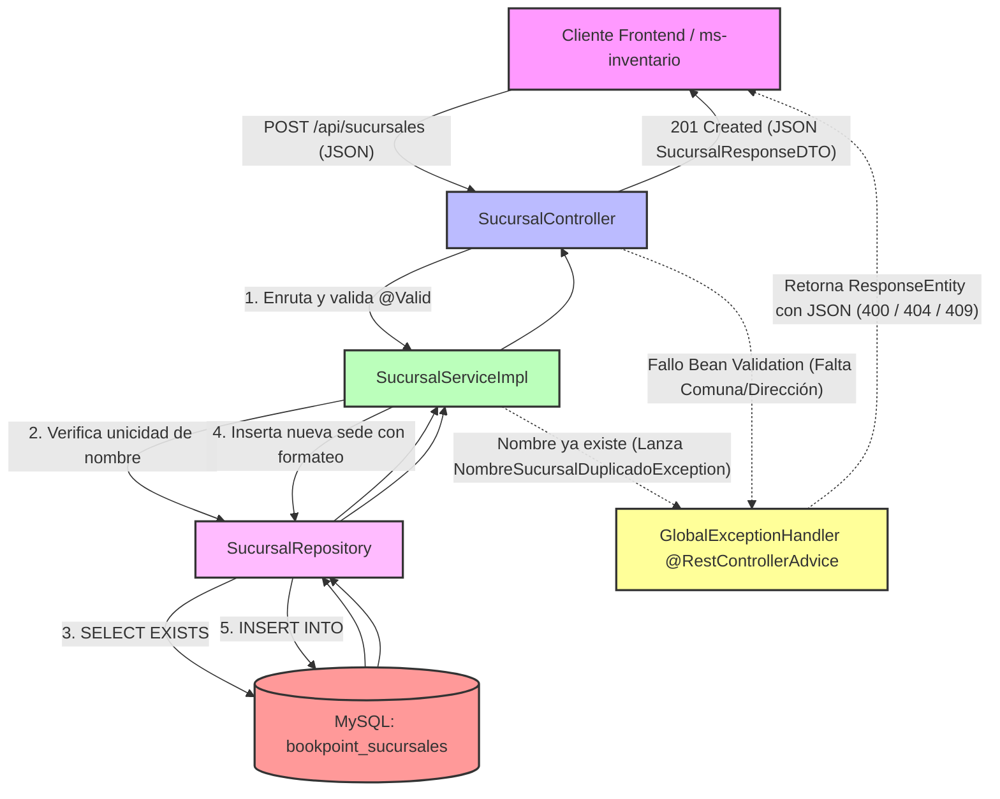

# Microservicio ms-sucursales - BookPoint Chile
> **Área:** Maestro de Datos Geográficos y Sucursales Físicas  
> **Arquitectura:** Microservicios con Spring Boot (Java 17) bajo Patrón CSR  
> **Puerto por Defecto:** `8090`

---

## 1. Visión General y Responsabilidades

El microservicio **`ms-sucursales`** actúa como el **maestro único de datos geográficos y operativos** para todas las operaciones presenciales y de distribución de **BookPoint Chile**. Su responsabilidad principal es centralizar y estandarizar la información pública, telefónica y logística de todas las tiendas y bodegas del país.

### Reglas de Negocio y Responsabilidades Críticas:
*   **Maestro Geográfico Corporativo:** Provee el catálogo oficial de sucursales habilitadas (incluyendo nombres comerciales, direcciones físicas, comunas, regiones y horarios de atención) para que otros microservicios satélite (como `ms-inventario` para cuadrar stocks físicos y `ms-logistica` para trazar orígenes de despachos) puedan consumir y validar ubicaciones reales.
*   **Unicidad Comercial de Sede:** Impide el registro de sucursales duplicadas forzando una restricción de unicidad estricta sobre el nombre comercial (`nombre`).
*   **Formateo e Inyección Lógica (Service Layer):** Controla que toda la información geográfica esté estandarizada. Si no se especifican regiones u horarios detallados en la solicitud de creación, la capa de servicios inyecta automáticamente valores por defecto y formatea los textos de forma unificada (ej: Capitalización de nombres de comunas y eliminación de espacios redundantes).

---

## 2. Diagrama de Estructura e Interoperabilidad (Mermaid)

El siguiente flujo detalla el comportamiento del microservicio bajo el patrón CSR, ilustrando el camino que sigue una petición desde el cliente REST hasta su persistencia relacional en MySQL:



---

## 3. Tecnologías Core e Implementación Técnica

*   **Spring Boot 3.2.5:** Plataforma central del microservicio que provee inyección de dependencias y despliegue rápido.
*   **Spring Data JPA (Hibernate):** Simplifica la persistencia orientada a objetos en bases de datos relacionales MySQL.
*   **Restricciones Relacionales:** Forzado del índice único `@Column(unique = true, nullable = false)` en el atributo `nombre` en la entidad `Sucursal` para impedir nombres comerciales redundantes.
*   **JSR 380 (Bean Validation 3.0):** Implementa anotaciones de validación en `SucursalRequestDTO` para blindar la capa de entrada:
    *   `@NotBlank` en `nombre`, `direccion` y `comuna` para impedir registros incompletos o nulos.
*   **SLF4J (Logback):** Integración de `@Slf4j` de Lombok en `SucursalServiceImpl` para auditoría operativa (`log.info` en inauguraciones) y alertas preventivas (`log.warn` en intentos de duplicación o inconsistencia).

---

## 4. Documentación de Endpoints REST

La API REST cuenta con CORS habilitado (`@CrossOrigin`) facilitando la interoperabilidad con clientes web dinámicos:

| Método HTTP | Endpoint | Descripción | Códigos HTTP de Respuesta |
| :--- | :--- | :--- | :--- |
| **GET** | `/api/sucursales` | Devuelve el catálogo consolidador de todas las sedes operativas. | `200 OK` (Éxito) |
| **GET** | `/api/sucursales/{id}` | Recupera los detalles geográficos e informativos de una sede particular. | `200 OK` (Encontrada)<br>`404 Not Found` (Sede inexistente) |
| **POST** | `/api/sucursales` | Registra e inaugura una nueva sucursal o bodega física en el sistema. | `201 Created` (Éxito)<br>`400 Bad Request` (Falta nombre, dirección, o comuna)<br>`409 Conflict` (Nombre de sucursal ya existe) |
| **PUT** | `/api/sucursales/{id}` | Permite actualizar la dirección, teléfonos o los horarios de atención de la sede. | `200 OK` (Actualizada)<br>`400 Bad Request` (Datos inválidos)<br>`404 Not Found` (ID inexistente)<br>`409 Conflict` (Nombre nuevo colisiona) |

---

## 5. Pruebas de Integración (Postman Payloads)

### ✅ Happy Path: Registro Exitoso de una Nueva Sucursal
*   **Método:** `POST`
*   **URL:** `http://localhost:8090/api/sucursales`
*   **Body (JSON Raw):**
```json
{
  "nombre": "Sucursal Santiago Centro",
  "direccion": "Av. Libertador Bernardo O'Higgins 1020",
  "comuna": "Santiago",
  "region": "Región Metropolitana",
  "telefono": "+56 2 2456 7890",
  "horarioAtencion": "Lunes a Sábado 09:00 a 20:00"
}
```
*   **Respuesta Esperada (201 Created):**
```json
{
  "id": 4,
  "nombre": "Sucursal Santiago Centro",
  "direccion": "Av. Libertador Bernardo O'Higgins 1020",
  "comuna": "Santiago",
  "region": "Región Metropolitana",
  "telefono": "+56 2 2456 7890",
  "horarioAtencion": "Lunes a Sábado 09:00 a 20:00",
  "estadoOperativo": "ACTIVO"
}
```

---

### ❌ Flujo de Error: Omisión de Campos Obligatorios (400 Bad Request)
*   **Método:** `POST`
*   **URL:** `http://localhost:8090/api/sucursales`
*   **Body (JSON Raw):**
```json
{
  "nombre": "Sucursal Providencia",
  "region": "Región Metropolitana"
}
```
*   **Explicación:** Se intentó crear una sucursal sin proveer ni la `direccion` ni la `comuna` (campos obligatorios en la firma JSR 380). El validador del Controller intercepta la llamada, aborta el flujo y el `@RestControllerAdvice` devuelve una respuesta formateada **HTTP 400 Bad Request**:

*   **Respuesta Esperada (400 Bad Request):**
```json
{
  "timestamp": "2026-05-24T19:58:12.987654",
  "status": 400,
  "error": "Validation Failed",
  "message": "Input validation errors occurred.",
  "path": "/api/sucursales",
  "details": [
    "La dirección de la sucursal es obligatoria",
    "La comuna es obligatoria"
  ]
}
```

---

## 6. Instrucciones de Ejecución

### Requisitos Previos:
1.  **Java JDK 17** configurado.
2.  **Apache Maven 3.8+** instalado.
3.  **MySQL Server** configurado localmente.

### Base de Datos:
1.  Crea un esquema vacío llamado `bookpoint_sucursales` en MySQL:
    ```sql
    CREATE DATABASE bookpoint_sucursales;
    ```
2.  Valida la cadena de conexión en tu `application.properties`:
    ```properties
    spring.datasource.url=jdbc:mysql://localhost:3306/bookpoint_sucursales?createDatabaseIfNotExist=true&useSSL=false&serverTimezone=UTC
    spring.datasource.username=root
    spring.datasource.password=tu_contraseña
    ```

### Sembrado Automático de Datos (Boot Seeder):
El microservicio ejecuta `DataInitializer.java` al arrancar. Si detecta la base de datos vacía, inyectará automáticamente los tres pilares geográficos de BookPoint:
1.  **"Bodega Central Concepción"** (Ubicada estratégicamente en la comuna de Hualpén).
2.  **"Sucursal Temuco"**.
3.  **"Sucursal La Serena"**.

### Levantar el Microservicio:
Ejecuta la siguiente instrucción desde la raíz de `ms-sucursales`:

```bash
mvn clean spring-boot:run
```

El microservicio se iniciará en el puerto **`8090`**, operando como el catálogo oficial de sucursales.
